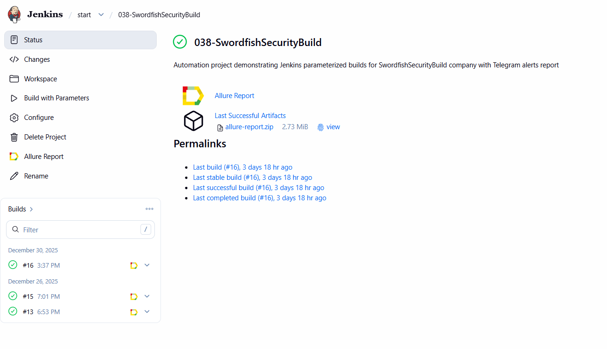
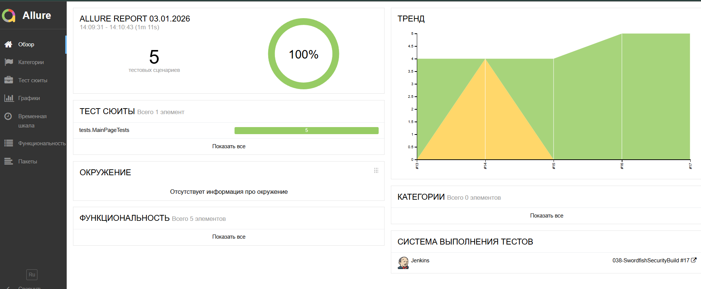
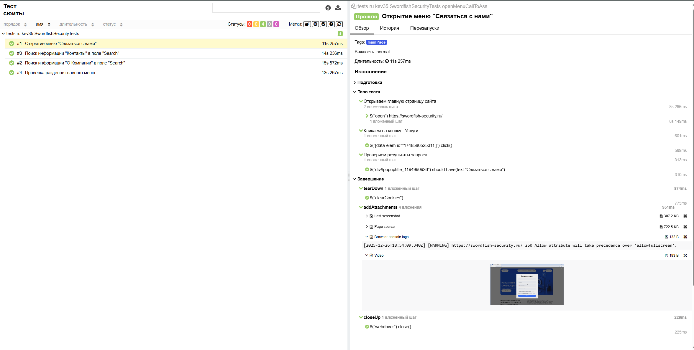
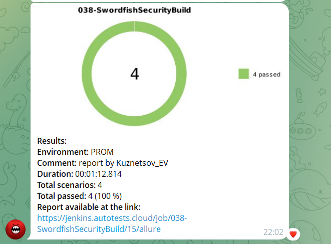
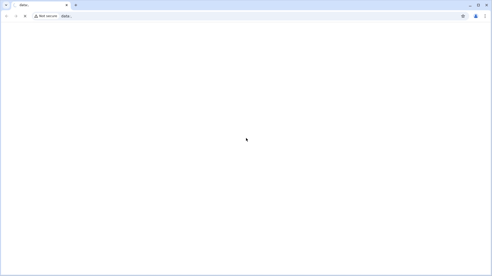

# Проект по автоматизации тестирования для компании [SWORDFISH SECURITY](https://swordfish-security.ru/)


> Эксперты Swordfish Security помогают выстроить комплексную защиту программного обеспечения и систем с искусственным интеллектом, снижая вероятность атак на ПО через уязвимости, компрометацию моделей и агентов.

## <a name="Содержание">**Содержание:**</a>
____

- [Технологии и инструменты](#технологии-и-инструменты)
- [Примеры автотестов](#примеры-тест-кейсов)
- [Сборка в Jenkins](#сборка-в-jenkins)
- [Запуск тестов](#запуск-тестов)
- [Пример Allure отчета](#пример-allure-отчета)
- [Уведомления в Telegram](#уведомления-в-telegram)
- [Видео примера запуска тестов Selenoid](#ввидео-примера-запуска-тестов-selenoid)
____

## <a name="Технологии и инструменты">**Технологии и инструменты:**</a>

<p align="center">   
<a href="https://www.java.com/"></a>
<a href="https://www.jetbrains.com/idea/"></a>
<a href="https://github.com/"></a>   
<a href="https://gradle.org/"></a>
<a href="https://junit.org/junit5/"></a>
<a href="https://selenide.org/"></a>  
<a href="https://aerokube.com/selenoid/"></a>  
<a href="ht[images](images)tps://github.com/allure-framework/allure2"></a>  
<a href="https://www.jenkins.io/"></a>  
<a href="https://www.atlassian.com/software/jira/"></a>
</p>

В данном проекте автотесты написаны на языке <code>Java</code> с использованием фреймворка для тестирования <code>Selenide</code>.
- В качестве сборщика был использован - <code>Gradle</code>.
- Использованы фреймворки <code>JUnit 5</code> и <code>Selenide</code>.
- Прогон автотестов запускается на удалённом сервере <code>Selenoid</code>.
- Запуск реализован через <code>Jenkins</code> с формированием Allure-отчета и отправкой результатов в <code>Telegram</code> при помощи бота.
- Интеграция с <code>Jira</code>
____
## <a name="Примеры тест кейсов">**Примеры автотестов:**</a>
-  Проверка разделов главного меню
-  Поиск информации "О Компании" в поле "Search"
-  Поиск информации "Контакты" в поле "Search"
-  Открытие меню "Связаться с нами"
-  Проверка открытия подробностей по кнопке "Подробнее"
____
## <a name="Сборка в">**Сборка в Jenkins**</a> 
[Ссылка на сборку в Jenkins](https://jenkins.autotests.cloud/job/038-SwordfishSecurityBuild/) 



____
## <a name="Запуск тестов">**Запуск тестов:**</a>
###  Локальный запуск тестов в Idea
____
```
gradle clean test
```
###  Удалённый запуст тестов в Jenkins
____
```
clean test
-Dbrowser=${BROWSER}
-DbrowserVersion=${BROWSER_VERSION}
-DbrowserSize=${BROWSER_SIZE}
-Dremote=https://user1:1234@${REMOTE}/wd/hub
```
____
## <a name="Пример Allure отчета">**Пример Allure отчета**</a> 

[Ссылка на Allure отчёт](https://jenkins.autotests.cloud/job/038-SwordfishSecurityBuild/15/allure/)
### 
### 
____
## <a name="Уведомления в Telegram">**Уведомления в Telegram**</a> 
### 
____
## <a name="Видео примера запуска тестов в Selenoid">**Видео примера запуска тестов в Selenoid:**</a>
<p align="center">  

</p>


